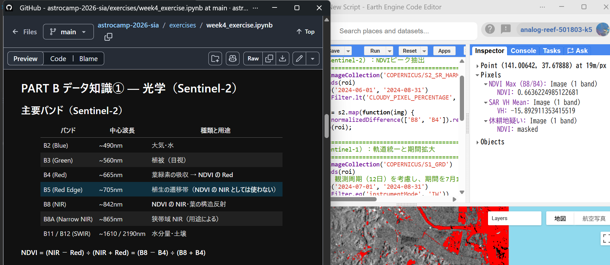
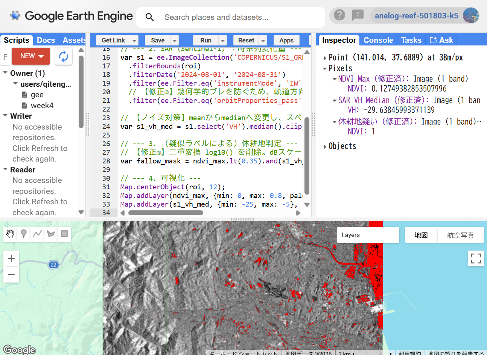
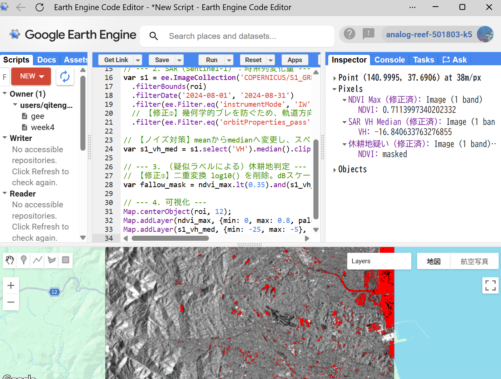

# Week 4 Exercise Log — @mio

## PART A 背景知識① — 対象エリアと「作付 / 休耕」の現象

###  対象エリアの特性

対象は福島県浜通りの相馬市・南相馬市の農地。

・沿岸部の平坦な農地で、水田・畑の作付と休耕（遊休農地）が混在
・2011年の東日本大震災と東京電力福島第一原子力発電所事故の避難対象地域を含む
・現在は農地整備（大区画化・土壌の除染）が進み、作付の再開と休耕が併存

###　季節サイクル（水田の例）

| 時期 | 農地の様子 | 光学（NDVI） | SAR（σ⁰ VH） |
|------|-----------|-------------|--------------|
| 4月 | 代かき前・休耕中 | 低い（裸土） | 中（土の表面散乱） |
| 5月 | 湛水期（水張り） | 低い（水面） | **暗い（鏡面反射）** |
| 6〜7月 | 生育期 | 上昇 | 高（葉の構造散乱） |
| 8月 | 最盛期・収穫前 | ピーク付近 | 高（体積散乱） |
| 収穫後 | 裸土・稲わら | 低下 | 低下 |

### チーム課題A
5月の湛水による水面の鏡面反射(SAR-VVの急落)と8月の作物の生長による体積錯乱(SAR-VHの上昇)及び光学NDVIのピーク、休耕地ではこれらが一切発生せず平坦なままになることから、作付と休耕が区別できる。

時期：５月（湛水期）と８月（最盛期）
５月に水が張られている事、８月に実際に植物が生長していることを確認することで、単に雑草が夏場に生い茂ってNDVIが高くなってしまっている休耕地と見分けるため。

##　PART B  データ知識①　 — 光学（Sentinel-2）

###  NDVIの計算式：
$$ NDVI = \frac{\text{B8} - \text{B4}}{\text{B8} + \text{B4}} $$

###  「B5 を NIR に使うとどうなるか」
B5(red edge: ~705nm)は植物のNIRの強い反射を十分に捉えられる波長ではないので、B8の代わりに使うと植物の元気さを低く見積もってしまう。上記のNDVIを求める式のB8の部分にB5を当てはめた場合、同じ植生を測定していてもB5の値はB8と比較して低いので、全体としてNDVIの値が低く見積もられてしい、実際には作物が多い地域でも荒れ地や休耕地として判断されかねない。

###  「CRS（座標系）を揃えないとどうなるか」
Sentinel-2の画像ピクセルと緯度経度や平面直角座標系の外部ポリゴンのCRSが不一致のままになってしまう。そうなると、数メートル～数百メートルと位置のずれが発生し、本来は別の圃場であるピクセル値が混入する。これにより、境界線付近の正しい農地判定ができなくなる。

##  PART B  データ知識②　— SAR（Sentinel-1）

###  VV と VH の違い
VV(垂直送受信)は地面や水面に対する感度か高く、例えば5月の湛水における水面の`鏡面反斜`による信号の減衰を正確に捉えることができる。一方、VH(垂直送信・水平受信)は植物の複雑な構造によって電波の向きが跳ね返る`体積錯乱`に敏感である。

###  S1_GRD が dB なのに 10*log10() をしてはいけない理由
Google Earth Engine（GEE）の COPERNICUS/S1_GRD アセットに格納されている値は、すでに地上側での前処理（対数変換）が完了したdB（デシベル）スケールの実数であるため。

###  昇交・降交を揃えないと時系列で何が起こるか
SARは斜め上から電波を照射するため、同じ農地であっても、電波の入射角や照射方向が変わってしまう。これらを混在させると作物の変化ではない、観測機器による値のズレが時系列データに発生し、真の変化を誤読する。

###  スペックルへの対応例
(スペックルとは：SAR画像に出てしまう「ザラザラ・つぶつぶした見た目のノイズ」のこと)
SAR特有の斑点状の微小なノイズを減らすために、単一ピクセルで判断するのではなく、農地を複数ピクセルとまとめて一つとしておいてそこの中央値や平均値を算出すること。
また、ある一時期のみ特出したSARの値を出してしまっていた場合などは、複数時期の画像を比較することで実際の値なのか誤差であったのかを判断すること。

##  PART B  データ知識③ — 解析を支える公開データ

### 選定したエリア
福島県南相馬市小高区・原町区周辺の沿岸部農地・相馬市磯部地区周辺の水田

###  選定した理由
当該エリアは東日本大震災の津波被災及び原発事故の避難指示区域の解除後に大規模な農地再整備が行われた地域である。現在は、スマート農業の促進や担い手不足によって発生している休耕地などの問題にも直面している。そのため衛星データを利用した検証を通して衛星を通して費用対効果を実証する対象地として適している。

##  PART C  手を動かす① — GEE Code Editor で「AI生成コード（罠入り）」を実行する

###  exercises/week4_gee.jsを実装した結果　灰色の部分をクリックした

##  PART C 手を動かす② — 正しいデータスタックに修正する

###  赤色(休耕地と考えられる場所)をクリックした結果

###  灰色の部分(農地)と考えられる部分をクリックした結果

###  変化前後で「どう変わるか」「放置するとどの誤判定になるか」

## 解析における主な罠と誤判定への影響

|  | ① NDVI | ② 軌道 | ③ 二重変換 |
|---|---|---|---|
| **罠** | `['B5', 'B4']` を使用してNDVIを計算している。  標準的なNDVIでは `['B8', 'B4']` を使用する。 | 昇交・降交軌道を混在させて解析している。  例：`filter(ee.Filter.eq('orbitProperties_pass', 'DESCENDING'))` などで軌道を統一する必要がある。 | すでにdB化されたSARデータに対して、さらに `log10()` を適用している。  例：`s1_vh_mean.log10().multiply(10)` |
| **どう変わるか** | B5（Red Edge）はB8（NIR）とは波長特性が異なるため、通常のNDVIとして解釈できない値になる。  葉緑素による吸収の影響などから、植生の反射特性を正しく捉えられず、NDVIが実態より低く評価される可能性がある。 | 昇交・降交では観測条件や入射角が異なるため、後方散乱係数 `σ⁰` が時系列上で数dB単位で変動することがある。  本来の「湛水による後方散乱の低下」と、軌道・観測条件による変動が混ざってしまう。 | dB値はすでに対数変換された値であるため、さらに `log10()` を適用すると物理的に不適切な変換になる。  例えば `-15 dB` に対して `log10(-15)` を計算することはできず、NaN等の異常値につながる。 |
| **放置するとどの誤判定になるか** | **【誤判定】青々と育っている正規の作付地を「休耕地」と誤認識する。**  正常に生育している稲作地でもNDVIが低く算出され、作付地として検出されなくなる。その結果、実際には作付されている農地が「休耕地」として自治体等の確認対象となり、不要な現地確認・見回りが発生する。 | **【誤判定】湛水（水張り）の時期を見落とす、または乾燥した裸地を湛水と誤認する。**  5月などに発生する湛水による「鏡面反射による後方散乱の急低下」が、軌道差による変動に埋もれる可能性がある。一方で、軌道による一時的な低下を湛水シグナルと誤認する可能性もある。 | **【誤判定】農地が大量に「休耕地」と判定され、解析全体が機能しなくなる。**  すでにdB値であるデータを再度 `log10()` 変換すると異常値が発生し、正常な判定ができなくなる。また、`-20 dB` のような極端な閾値を設定すると、作物の有無ではなく、非常に強い鏡面反射やノイズフロア付近の状態だけを捉えることになり、通常の休耕地や植生地を適切に区別できなくなる。 |
| **推奨する修正** | Sentinel-2の標準的なNDVIとして、 `normalizedDifference(['B8', 'B4'])` を使用する。 | `orbitProperties_pass` を利用して昇交または降交のどちらかに統一する。  例：`filter(ee.Filter.eq('orbitProperties_pass', 'DESCENDING'))` | Sentinel-1の値がすでにdBである場合は、再度 `log10()` しない。  スペックル低減のために `median()` 等で平滑化した後、dBのまま閾値判定する。  例：`s1_vh_med.lt(-18)` |

##  PART C 手を動かす③ — AIへの「5つの問い」で批判的に確認する

 
  **5 つの問い**
  ①**単位は？** … `S1_GRD` はすでに dB なのに `10*log10()` をさらに足していないか 
  ②**バンド・偏波は？** … NDVI は `B8` & `B4`？ SAR は `VV` / `VH`？ HH を指定していないか
  ③**座標系（CRS）は？** … 画像と外部ポリゴンの CRS（EPSG:32654 / JGD2011 等）は揃っているか？ 
  ④**軌道・観測モードは？** … ASC / DESC を統一しているか？観測モードは IW？
  ⑤**観測時期・雲量は？** … 季節サイクルに合う時期か？ 雲量フィルタはあるか？

### ①NDVIのバンド誤用
・**②バンド・偏波**で発見
・専門家向け：植生の近赤外高反射特性を評価するには、B8(842nm)の波長帯を使用するのが適切。B5(705nm)はRed Edgeの始点であり植生の波長を十分に反映できない。
・非専門家向け：カメラでいう「赤外線モード」にするべきところを、中途半端な設定にしているため、青々とした立派な稲が画面上では「枯れたカサカサの土」と同じ色に映ってしまう。
・どちらにも：正常に作物が育っている場所を正しく「緑」として認識するための、最も適切なバンドのセンサーを使用する必要がある・

### ②軌道(昇交/降交)の混在
・**④軌道・観測モードは？**で発見
・専門家向け：散乱係数 $\sigma^0$ は入射角（$\theta$）の関数です。同じ時系列解析においてAscendingとDescendingを混合させてしまうと、局所的なデータが実際の値なのか軌道による違いなのかが読み取れない。
・非専門家向け：朝に西から撮った写真」と「夕方に東から撮った写真」を混ぜてパラパラマンガを作っている状態。影の向きや光の当たり方が毎回バラバラなので、地面が変化していないのに、画面上ではチカチカと明暗が激しく動いてしまい、正しい変化が追えない。
・どちらにも：観測する「カメラの向きと時間帯」を一つに統一することで、純粋な「農地の状態の変化」だけをクリアに抜き出すことができる。

### ③dBデータの二重変換と閾値破綻
・**①単位は？**で発見
・専門家向け：COPERNICUS/S1_GRD は、すでにSigma0に対して $10 \log_{10}$ 処理が施された対数スケール（dB）で提供されている。ここに再度対数関数をかけるのは数理的に破綻してしまう。
・非専門家向け：すでに「デシベル（音の大きさのような単位）」に直してある計算メーターを、AIが勘違いして「もう一回デシベル計算の機械」に投入したため、メーターの針が振り切れて壊れてしまう。
・どちらにも：データの数字を正しいルール（単位）で読み込み、画面のザラザラを滑らかにしてから、本物の休耕地を正確に炙り出すための修正である。

## PART D   解析計画書は以下のリンクで示す。
https://docs.google.com/document/d/1BRspZTgDZRqbarEmjE_UpwNyhRIa5yx7PQT43irHb8s/edit?tab=t.8bqbw2su3h3z
