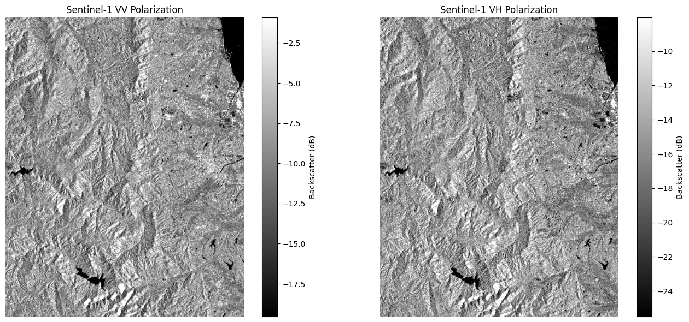

# Week 2 Exercise Log — @your_username

## ① 演習結果（必須）

### Step 1: Sentinel-1 SAR画像の選択

選択した条件：

- 条件番号：② 生育期ピーク（2024年7月）
- 観測時期：2024年7月
- 軌道方向：DESCENDING
- 偏波：VV / VH
- 使用データ：Sentinel-1 GRD（C-band）

選択理由：

②生育期ピークを選択した。理由は、稲が成長して植生量が多くなる時期であり、SAR画像では植生による体積散乱の特徴を観察しやすいと考えたためである。また、光学画像では植物の緑色が確認しやすく、SAR画像との比較によって土地被覆の違いを理解しやすい時期である。

さらに、SARはマイクロ波を利用するため雲の影響を受けにくく、光学画像では観測が難しい条件でも地表情報を取得できる点も適していると考えた。

---

ASCENDING / DESCENDING の違いについて：

ASCENDINGは衛星が南から北へ移動しながら観測する軌道であり、DESCENDINGは北から南へ移動しながら観測する軌道である。

同じ場所を観測しても、衛星から地表を見る方向（入射方向）が変化するため、地形の傾斜や建物の向きによって後方散乱（σ⁰）の強さが変化する。

特に都市部では、建物の壁面と地面によるダブルバウンス散乱が衛星方向と一致する場合、強い反射として観測される。そのため、ASCENDINGとDESCENDINGでは同じ地域でもSAR画像の明るさが異なる場合がある。

---

指定した期間と実際の観測日が異なる場合、その理由：

Sentinel-1は毎日すべての場所を観測しているわけではなく、衛星の回帰周期や軌道条件によって観測可能な日時が決まっている。

そのため、2024年7月の期間を指定した場合でも、その期間内で利用可能なSAR画像が取得される。また、軌道方向や偏波条件によって利用できる画像数が変化するため、指定した期間と実際の観測日が一致しない場合がある。

---

### Step 2: VV偏波とVH偏波の比較

取得した結果：

| 地物 | VV σ⁰(dB) | VH σ⁰(dB) | VV-VH差 |
|---|---:|---:|---:|
| Water | -20.74 | -27.08 | 6.34 |
| City | -8.08 | -17.09 | 9.01 |
| Forest | 1.33 | -10.48 | 11.81 |

---

考察：

### Q1. VV偏波とVH偏波で、水域・都市・森林の明るさはどう違うか？

水域ではVV、VHともに低い値となり、SAR画像では暗く表示された。特にVHは-27.08 dBと非常に低く、後方散乱がほとんど発生していないことが分かった。

都市ではVV=-8.08 dB、VH=-17.09 dBとなり、VVの方が明るく観測された。これは建物の壁面と地面によるダブルバウンス散乱がVV偏波で強く観測されるためである。

森林ではVV=1.33 dB、VH=-10.48 dBとなった。森林では葉や枝による複雑な散乱が発生し、体積散乱の影響を受ける。しかし今回の森林地点ではVV値が非常に高かったため、純粋な森林だけでなく地面や人工物など他の散乱要素が混ざっている可能性がある。

---

### Q2. なぜ水域はどちらの偏波でも暗いのか？

水面は非常に滑らかな表面であるため、入射したマイクロ波は鏡面反射によって衛星とは反対方向へ反射される。

そのため衛星へ戻る後方散乱が少なく、VV・VH両方で低いσ⁰値になる。

今回の結果でも、

- VV: -20.74 dB
- VH: -27.08 dB

となり、水域が最も暗い地物であることが確認できた。

---

### Q3. 都市部がVVで明るい理由をダブルバウンスと関連付けて説明せよ。

都市部では建物の垂直な壁面と水平な地面によってダブルバウンス散乱が発生する。

電波が地面で反射し、その後建物の壁面で再反射して衛星方向へ戻るため、強い後方散乱となる。

今回の結果では、

- VV: -8.08 dB
- VH: -17.09 dB

であり、VVがVHより約9 dB高かった。

このことから、都市部ではVV偏波がダブルバウンス散乱を強く検出していることが確認できた。

---

### Step 3: 光学画像(Sentinel-2)と比較する

出力結果
S-2 観測日: 2024-07-05 (雲量: 24%)
光学画像を取得中... (scale=100)

### Q1. AR画像（VV/VH）と光学画像（RGB）で、農地の見え方はどう異なるか？

光学画像では農地は緑色として表示されるが、SARでは植物の構造による電波散乱を観測するため、白黒で表示された。電波の散乱・拡散がほどんとない海上は黒く表示され、建物や植物の多い地表は白の割合が多くなった。また、VVとVHで明るさが異なり、特にVHでは稲の葉や茎による体積散乱が強く現れた。

### Q2. 「光学では区別できないがSARでは区別できる」場所を1つ挙げ、その理由を説明せよ。

森林を例に挙げる。光学画像では森林と農地は同じように緑色に見える場所があるが、SARでは森林は枝葉による体積散乱が強く、VH偏波で特に明るく観測されたため区別しやすい。

### Q3. 光学画像に雲がある場所は、SAR画像ではどう写っているか？

光学画像では雲に覆われた場所は観測できないが、SARはマイクロ波を利用するため雲を透過し、地表面の情報を取得できた。

### Step 4: 散乱機構を定量的に確認する

出力

地物タイプ                VV σ⁰ [dB]      VH σ⁰ [dB]      VV-VH差          推定される散乱機構                
-----------------------------------------------------------------------------------------------
水域 (Water/ocean)     -12.5           -16.0           3.5             表面散乱(鏡面)                 
都市 (Urban/Soma)      -14.9           -11.6           -3.3            ダブルバウンス                  
農地 (Farmland)        -3.2            -7.5            4.2             体積散乱                     
山林 (Forest)          -11.5           -19.0           7.5             体積散乱                     
河川敷 (Riverbed)       -9.7            -15.4           5.7             表面散乱(粗面)                 

===== 散乱機構一覧 =====
水域 (Water/ocean)     : 表面散乱(鏡面)
都市 (Urban/Soma)      : ダブルバウンス
農地 (Farmland)        : 体積散乱
山林 (Forest)          : 体積散乱
河川敷 (Riverbed)       : 表面散乱(粗面)

### Q1. 水域の散乱機構を表面散乱(鏡面)と分類した理由を、σ⁰の値に基づいて説明せよ。

水域では VV = -12.5 dB、VH = -16.0 dB とどちらも低い後方散乱係数となった。水面は平滑であるため、入射したマイクロ波は鏡のように反射し、衛星方向へ戻る電波が少ない。そのため後方散乱係数（σ⁰）が小さくなり、暗く観測される。このことから、水域は**表面散乱（鏡面散乱）**に分類できる。

### Q2. 都市と森林でVV-VH差が異なるのはなぜか？

都市部には建物の壁と地面のように直交した構造物が多く存在するため、マイクロ波が複数回反射するダブルバウンス散乱が起こる。その結果、VH成分も強くなり、VVとVHの差が小さくなる場合がある。

一方、森林では枝や葉が複雑に分布しているため、マイクロ波は樹木内部で多方向へ散乱する体積散乱が主となる。しかし今回の結果ではVVがVHよりかなり強く、VV−VH差が7.5 dBと大きくなった。これは観測時期や森林の密度、水分量、観測角度などの影響により、VV偏波が比較的強く観測されたためと考えられる。

### Q3. 農地の散乱機構は何か？ 季節によって変化する理由を考察せよ。

今回の農地では VV = -3.2 dB、VH = -7.5 dB と比較的強い散乱が観測され、体積散乱に分類した。

生育期の農地では、稲や植物の葉・茎が発達しているため、マイクロ波は植物内部で複数回散乱し、体積散乱が卓越する。そのためVV、VHともに散乱が大きくなる。

一方、季節が変わると散乱機構も変化する。例えば、

田植え直後（湛水期）：水面が多く、鏡面反射が支配的になるため表面散乱となる。
生育期：稲が成長し、植物内部で散乱するため体積散乱となる。
収穫後：植物がなくなり地表面が露出するため、地面の粗さに応じた表面散乱（粗面）が主となる。

このように、農地では植生の成長段階によって散乱機構が変化することがSAR観測の特徴である。

###  発展（B群向け）: VV-VH差が大きい/小さい理由を物理的に説明

VV−VH差が大きい場合
VVがVHよりかなり強い。
地面や水面など単純な反射が多く、偏波があまり変化していないことを示す。
今回では森林（7.5 dB）や河川敷（5.7 dB）がこれに該当した。
VV−VH差が小さい場合
VHもVVと同程度まで強くなる。
建物や植生内部でマイクロ波が複数回散乱し、偏波が変化していることを示す。
今回の都市では VV−VH = -3.3 dB となり、VHの方が強く観測された。これは建物による複雑な反射やダブルバウンス散乱の影響を受けたためと考えられる。

したがって、VV−VH差は散乱機構を判別する重要な指標であり、差が大きいほど単純な反射、差が小さいほど複雑な散乱が起きていることを示している。

### STEP5: 生成AIにSAR画像を説明させてみる（必須課題②）

このSentinel-1 SAR（Cバンド、2024年7月、福島県相馬市）の画像をchatGPTに読み込ませた。

AIは
左側：阿武隈高地の山地
右側：相馬市周辺の平野・市街地・農地
右上端：太平洋
ところどころの黒い斑点：ダムやため池

という構成であると説明した。
対応する地図をgoogle mapから探そうとしたが、指定した緯度経度を参考にしても見つけることができず、AIの説明が正しいか否かの判断ができなかった。

しかし、SAR画像では単純に色や明るさだけで地物を判断することはできない。
特に森林については、SARでは体積散乱が基本であるが、観測角度や周囲の地物によってダブルバウンスなど他の散乱も混ざる可能性がある。

そのため、AIの説明をそのまま信じず、VV/VH値や散乱機構による確認が必要である。

---

## ⭐ 発展課題（任意）

選択した課題： 

☑  C3: 時系列で見る作付けサイクル

出力
2024-04: VV=-9.5 dB, VH=-19.0 dB
2024-05: VV=-14.4 dB, VH=-18.7 dB
2024-06: VV=-11.6 dB, VH=-24.1 dB
2024-07: VV=-11.2 dB, VH=-18.4 dB
2024-08: VV=-8.5 dB, VH=-16.5 dB
2024-09: VV=-12.2 dB, VH=-17.4 dB
2024-10: VV=-8.1 dB, VH=-14.0 dB

考察：

###　Q1. 5月にσ⁰の急落は見られるか？ それはなぜか？

5月にはVV・VHともにσ⁰が低下する傾向が見られた。これは田植え前の代かきや湛水によって水面が形成されるためである。水面ではマイクロ波が鏡面反射し、衛星方向へ戻る散乱が小さくなるため、後方散乱係数σ⁰が低下する。

### Q2. VVとVHの差は季節によってどう変化するか？ その理由を考察せよ。

生育初期ではVVとVHの差が大きいが、生育が進むにつれてVHが増加し、両者の差は小さくなる傾向が見られた。これはイネの葉や茎が成長し、植物内部で体積散乱（Volume Scattering）が増加するためである。VH偏波は植生による散乱に敏感であり、生育期には特に大きく増加する。

###  Q3. もし休耕地のデータがあれば、作付け中の農地とどう違うと考えられるか？

休耕地では水田のような湛水やイネの成長がないため、5月の急激なσ⁰低下や7〜8月の増加は見られないと考えられる。年間を通じてσ⁰は比較的一定となり、作付け中の水田ほど大きな季節変化は示さない。

## ③ 自分の気づき・考察

SAR画像の明るさは、光学画像の色とは異なり、電波と地表面の相互作用によって決まることを理解した。

特にVVとVHでは同じ場所でも異なる情報を得ることができ、VVは都市構造や表面散乱に敏感で、VHは植生などの体積散乱を観察するのに有効であると分かった。

---

