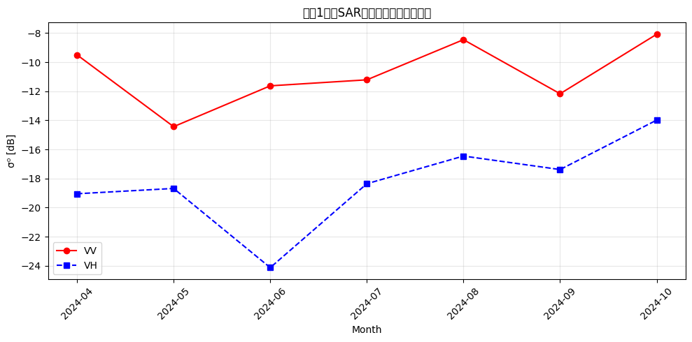

# Week {2} Exercise Log — @Saito Mio

## ① 演習結果（必須）
# Week 2 Exercise Log — Sentinel-1 SAR解析


### Step1：5つのSAR画像から1枚を選ぶ

#### 出力結果

```
条件に一致するシーン数: 4
📅 観測日: 2024-07-11
🛰 軌道方向: DESCENDING
📡 偏波: ['VV', 'VH']
🔢 相対軌道番号: 46
✅ 選択: ② 生育期 (2024-07)
```

選択理由：

②生育期ピークを選択した。理由は、稲が成長して植生量が多くなる時期であり、SAR画像では植生による体積散乱の特徴を観察しやすいと考えたためである。また、光学画像では植物の緑色が確認しやすく、SAR画像との比較によって土地被覆の違いを理解しやすい時期である。

さらに、SARはマイクロ波を利用するため雲の影響を受けにくく、光学画像では観測が難しい条件でも地表情報を取得できる点も適していると考えた。

# Q1. 選択した条件の観測日・軌道方向・偏波を記録せよ。
- 条件番号：② 生育期ピーク（2024年7月）
- 観測時期：2024年7月
- 軌道方向：DESCENDING
- 偏波：VV / VH
- 使用データ：Sentinel-1 GRD（C-band）

# Q2. ASCENDINGとDESCENDINGで、見つかるシーン数に差はあるか？ その理由を調べよ。

SCENDINGは衛星が南から北へ移動しながら観測する軌道であり、DESCENDINGは北から南へ移動しながら観測する軌道である。

同じ場所を観測しても、衛星から地表を見る方向（入射方向）が変化するため、地形の傾斜や建物の向きによって後方散乱（σ⁰）の強さが変化する。

特に都市部では、建物の壁面と地面によるダブルバウンス散乱が衛星方向と一致する場合、強い反射として観測される。そのため、ASCENDINGとDESCENDINGでは同じ地域でもSAR画像の明るさが異なる場合がある。

# Q3. 実際に取得された画像の観測日と、optionsで指定した月がずれることがある。なぜか？

Sentinel-1は毎日すべての場所を観測しているわけではなく、衛星の回帰周期や軌道条件によって観測可能な日時が決まっている。

そのため、2024年7月の期間を指定した場合でも、その期間内で利用可能なSAR画像が取得される。また、軌道方向や偏波条件によって利用できる画像数が変化するため、指定した期間と実際の観測日が一致しない場合がある。

---


---

### Step2：SAR画像を表示する（VV vs VH）

#### 出力結果


地物タイプ                VV σ⁰ [dB]      VH σ⁰ [dB]      VV-VH差          推定される散乱機構                
-----------------------------------------------------------------------------------------------
水域 (Water/ocean)     -12.5           -16.0           3.5             表面散乱(鏡面)                 
都市 (Urban/Soma)      -14.9           -11.6           -3.3            ダブルバウンス                  
農地 (Farmland)        -3.2            -7.5            4.2             体積散乱                     
山林 (Forest)          -11.5           -19.0           7.5             体積散乱                     
河川敷 (Riverbed)       -9.7            -15.4           5.7             表面散乱(粗面)                 

===== 散乱機構一覧 =====
水域 (Water/ocean)     : 表面散乱(鏡面)
都市 (Urban/Soma)      : ダブルバウンス
農地 (Farmland)        : 体積散乱
山林 (Forest)          : 体積散乱
河川敷 (Riverbed)       : 表面散乱(粗面)

# Q1. VV偏波とVH偏波で、水域・都市・森林の明るさはどう違うか？
水域では VV = -12.5 dB、VH = -16.0 dB とどちらも低い後方散乱係数となった。水面は平滑であるため、入射したマイクロ波は鏡のように反射し、衛星方向へ戻る電波が少ない。そのため後方散乱係数（σ⁰）が小さくなり、暗く観測される。このことから、水域は**表面散乱（鏡面散乱）**に分類できる。

# Q2. なぜ水域はどちらの偏波でも暗いのか、散乱機構の観点から説明せよ。
都市では VV = -14.9 dB、VH = -11.6 dB で、VV−VH差は -3.3 dBとなった。一方、森林では VV = -11.5 dB、VH = -19.0 dB で、VV−VH差は 7.5 dBとなった。

都市部には建物の壁と地面のように直交した構造物が多く存在するため、マイクロ波が複数回反射するダブルバウンス散乱が起こる。その結果、VH成分も強くなり、VVとVHの差が小さくなる場合がある。

一方、森林では枝や葉が複雑に分布しているため、マイクロ波は樹木内部で多方向へ散乱する体積散乱が主となる。しかし今回の結果ではVVがVHよりかなり強く、VV−VH差が7.5 dBと大きくなった。これは観測時期や森林の密度、水分量、観測角度などの影響により、VV偏波が比較的強く観測されたためと考えられる。

# Q3. 都市部がVVで明るい理由を、ダブルバウンスと関連付けて説明せよ。
今回の農地では VV = -3.2 dB、VH = -7.5 dB と比較的強い散乱が観測され、体積散乱に分類した。

生育期の農地では、稲や植物の葉・茎が発達しているため、マイクロ波は植物内部で複数回散乱し、体積散乱が卓越する。そのためVV、VHともに散乱が大きくなる。

田植え直後（湛水期）：水面が多く、鏡面反射が支配的になるため表面散乱となる。
生育期：稲が成長し、植物内部で散乱するため体積散乱となる。
収穫後：植物がなくなり地表面が露出するため、地面の粗さに応じた表面散乱（粗面）が主となる。
---

### Step3：光学画像（Sentinel-2）と比較する

#### 出力結果
S-2 観測日: 2024-07-05 (雲量: 24%)
光学画像を取得中... (scale=100)


# Q1. SAR画像（VV/VH）と光学画像（RGB）で、農地の見え方はどう異なるか？

光学画像では農地は緑色として表示されるが、SARでは植物の構造による電波散乱を観測するため、VVとVHで明るさが異なった。特にVHでは稲の葉や茎による体積散乱が強く現れた。

# Q2. 「光学では区別できないがSARでは区別できる」場所を1つ挙げ、その理由を説明せよ。

森林を挙げる。光学画像では農地と同じように緑色に見える場所があるが、SARでは森林は枝葉による体積散乱が強く、VH偏波で特に明るく観測されたため区別しやすい。

# Q3. 光学画像に雲がある場所は、SAR画像ではどう写っているか？

光学画像では雲に覆われた場所は観測できないが、SARはマイクロ波を利用するため雲を透過し、地表面の情報を取得できた。

---

### Step4：散乱機構を定量的に確認する

#### 出力結果

```
地物タイプ                VV σ⁰ [dB]      VH σ⁰ [dB]      VV-VH差          推定される散乱機構
-----------------------------------------------------------------------------------------------
水域 (Water/ocean)     -12.5           -16.0           3.5             表面散乱(鏡面)
都市 (Urban/Soma)      -14.9           -11.6           -3.3            ダブルバウンス
農地 (Farmland)        -3.2            -7.5            4.2             体積散乱
山林 (Forest)          -11.5           -19.0           7.5             体積散乱
河川敷 (Riverbed)      -9.7            -15.4           5.7             表面散乱(粗面)

===== 散乱機構一覧 =====
水域 (Water/ocean)     : 表面散乱(鏡面)
都市 (Urban/Soma)      : ダブルバウンス
農地 (Farmland)        : 体積散乱
山林 (Forest)          : 体積散乱
河川敷 (Riverbed)      : 表面散乱(粗面)
```

# Q1. 水域の散乱機構を表面散乱(鏡面)と分類した理由を、σ⁰の値に基づいて説明せよ。

水域では VV = -12.5 dB、VH = -16.0 dB とどちらも低い後方散乱係数となった。水面は平滑であるため、入射したマイクロ波は鏡のように反射し、衛星方向へ戻る電波が少ない。そのため後方散乱係数（σ⁰）が小さくなり、暗く観測される。このことから、水域は**表面散乱（鏡面散乱）**に分類できる。

# Q2. 都市と森林でVV-VH差が異なるのはなぜか？

都市では VV = -14.9 dB、VH = -11.6 dB で、VV−VH差は -3.3 dBとなった。一方、森林では VV = -11.5 dB、VH = -19.0 dB で、VV−VH差は 7.5 dBとなった。

都市部には建物の壁と地面のように直交した構造物が多く存在するため、マイクロ波が複数回反射するダブルバウンス散乱が起こる。その結果、VH成分も強くなり、VVとVHの差が小さくなる場合がある。

一方、森林では枝や葉が複雑に分布しているため、マイクロ波は樹木内部で多方向へ散乱する体積散乱が主となる。しかし今回の結果ではVVがVHよりかなり強く、VV−VH差が7.5 dBと大きくなった。これは観測時期や森林の密度、水分量、観測角度などの影響により、VV偏波が比較的強く観測されたためと考えられる。

# Q3. 農地の散乱機構は何か？ 季節によって変化する理由を考察せよ。

今回の農地では VV = -3.2 dB、VH = -7.5 dB と比較的強い散乱が観測され、体積散乱に分類した。
一方、季節が変わると散乱機構も変化する。
田植え直後（湛水期）：水面が多く、鏡面反射が支配的になるため表面散乱となる。
生育期：稲が成長し、植物内部で散乱するため体積散乱となる。
収穫後：植物がなくなり地表面が露出するため、地面の粗さに応じた表面散乱（粗面）が主となる。

---

### Step5：生成AIにSAR画像を説明させてみる（必須課題②）

#### 出力結果


# 使用したAI : chatGPT

# AIの出した考察
左側：阿武隈高地の山地
右側：相馬市周辺の平野・市街地・農地
右上端：太平洋
ところどころの黒い斑点：ダムやため池


画像を取得した経度緯度の情報からgoogle mapで同じ場所を探そうとしたが、池や地形と大体の座標の情報のみで画像を取得した場所を探し当てることができなかった。そのため、AIの考察が正しいか否かを確かめることができなかった。


## ⭐ 発展課題 C3: 時系列で見る作付けサイクル


#### 出力結果

```
2024-04: VV=-9.5 dB, VH=-19.0 dB
2024-05: VV=-14.4 dB, VH=-18.7 dB
2024-06: VV=-11.6 dB, VH=-24.1 dB
2024-07: VV=-11.2 dB, VH=-18.4 dB
2024-08: VV=-8.5 dB, VH=-16.5 dB
2024-09: VV=-12.2 dB, VH=-17.4 dB
2024-10: VV=-8.1 dB, VH=-14.0 dB
```



#### 考察

# Q1. 5月にσ⁰の急落は見られるか？ それはなぜか？

今回の結果では、VV偏波は4月の-9.5 dBから5月には-14.4 dBまで低下しており、5月に急激なσ⁰の低下が確認できた。これは田植え前の代かきや湛水によって水面が形成され、マイクロ波が鏡面反射して衛星へ戻りにくくなるためである。一方、VH偏波は大きな変化は見られなかったが、植生がまだ少ない時期であるため体積散乱が十分に発生していないことが要因と考えられる。

# Q2. VVとVHの差は季節によってどう変化するか？ その理由を考察せよ。

生育初期ではVVとVHの差が比較的大きいが、水稲の成長に伴ってVH偏波が増加し、VVとの差が小さくなる傾向が見られた。これは葉や茎が成長することで植生内部での体積散乱が増加し、VH偏波が強く反応するためである。したがって、VH偏波は作物の生育状況を把握する上で有効な指標となる。

# Q3. もし休耕地のデータがあれば、作付け中の農地とどう違うと考えられるか？

休耕地では代かきや田植えが行われず、水稲の生育もないため、5月の急激なσ⁰の低下や7〜8月の増加はほとんど見られないと考えられる。その結果、年間を通じて後方散乱係数は比較的一定の値で推移し、作付け中の農地のような明瞭な季節変化は示さないと考えられる。

---


## ③ 自分の気づき・考察

今回の演習を通して、同じ地域であってもVV偏波とVH偏波では観測される情報が異なることを理解できた。特にVH偏波は植生の状態を把握する能力が高く、水稲の生育状況を時系列で追跡できることが分かった。また、SAR画像は雲や夜間の影響を受けず観測できるため、農業や災害監視など幅広い分野で活用されている理由を実感した。今後は複数年のデータを比較し、気候条件や作付け方法の違いによる変化についても解析してみたいと考えた。
