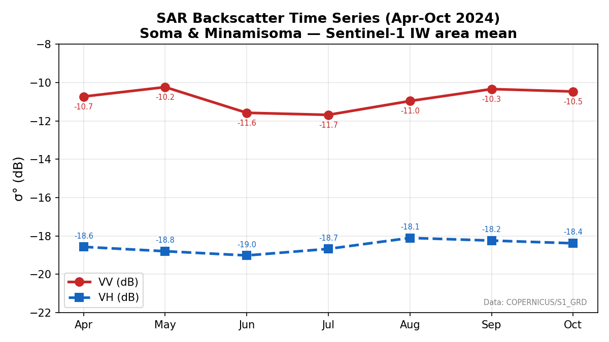
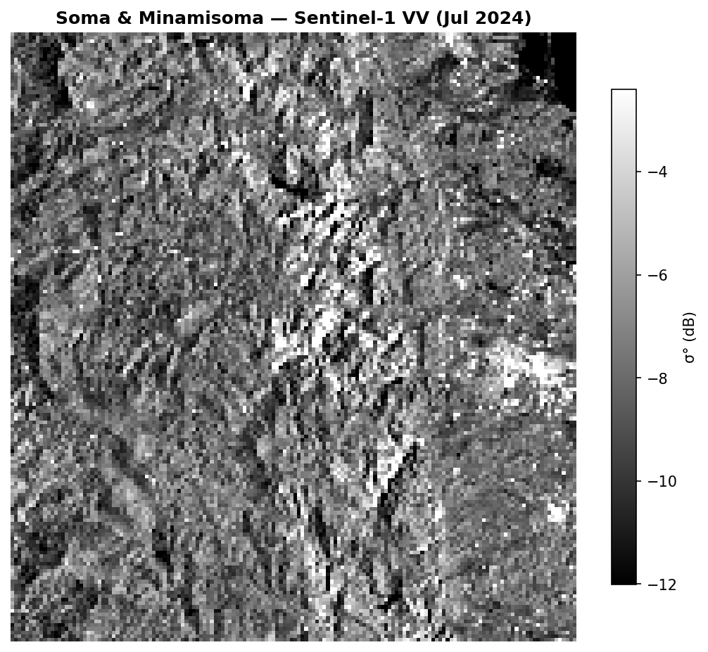

# Week {3} Exercise Log — @Saito Mio

## Step1: チームで議論

### 課題1：σ⁰時系列から区別できる農地は？
### 問:　以下の3つの状態を、σ⁰時系列だけで区別できるか？
  ① 作付け水田（4月湛水 → 5月移植 → 7月生育 → 9月収穫）
  ② 休耕地（草地化、年間を通じて雑草が生えている）
  ③ 収穫直後の水田（9月以降、わらのみ）

#### σ⁰時系列とは

σ⁰（シグマ・ゼロ）時系列とは、衛星SAR（合成開口レーダー）が観測した地表の後方散乱係数（σ⁰）を、時間順に並べたデータのことです。地表面の状態変化を把握するために、リモートセンシングで非常によく利用されます。

σ⁰とは

σ⁰（Sigma Naught）は、SARから照射したマイクロ波が地表で反射され、衛星に戻ってきた強さを、単位面積あたりに正規化した値です。

通常は**デシベル（dB）**で表されます。

#### 個人の回答
・作付け水田（4月湛水→5月移植→7月生育→9月収穫）と想定すると、水面の割合が大きいと考えられる4月5月は水面が鏡のように反射して電波が衛星に戻りにくいにも関わらずVVの値が大きく、信頼性が高いとは言えない
・一方、育成期である6月7月は、菊や葉の影響で体積散乱が発生しやすくVVの値が大きくなると予想できるがSAR衛星のデータからは他の月と比較してVV値が小さいため、信頼性が高いとは言えない
VHが上がる
・8月9月10月は収穫もしくは収穫後の状態のため、裸地になっていると考えられる。そのため、凹凸のある地面から反射して表面散乱が起こりやすくVV値は中程度になると考えられるが、図よりVV値は高い値であることが読みとれる。よって、信頼性が高いとは言えない

これらの結果から、作付け水田・休耕地・収穫直後の水田の3つの状態を、σ⁰時系列だけで区別することができるとは言えないと考える。

#### グループBの解答
一般論で考えた場合
①4月5月は鏡面散乱でVV値が低くなり、7月は体積散乱でVHが高くなり、9月は表面反射でVV値は4月よりは高いが低くなる
②休耕地はVH値は安定している
③収穫後は休耕地と似たような値になる

google colabで与えられたブラフから考えた場合
・一年を通してVV値及びVH値の値に大きな変化が見られないため、休耕地の影響（占める割合）が大きいと考えられる。
・VV値は4月5月の湛水の時期には値が小さくなることが予想されるがグラフより他の月と比較して値が大きいと読み取れる。よって、水田の割合が小さく水田のデータに与える影響が小さかったと考えられる。
・そもそも配布されたデータとSAR衛星画像データの取得された座標は合っているのかという疑問も挙げられた

### 課題2：データ選定の判断基準

#### (a) 観測モード：なぜIWを選ぶのか？

#### 個人の回答
・約10 mの空間分解能で圃場単位の解析が可能である
・農地解析に最も広く利用される標準観測モードである
・VV・VH偏波を同時取得でき、植生解析に適している

#### グループBの回答
・分解能・観測幅が最適であり、陸地の大半がIWなのでデータ量が豊富であるため

##### SM・EWと比較した欠点
・SM(Strip Mode)は分解能が5m*5mと高分解能であるため観測幅が狭く、広域農地には非効率である点
・EW(Extra Wide)は分解能が大きく観測域が広いため、１ピクセルに農地・森林・海など異なる種類のデータが含まれてしまいミスセルリスクが大きくなってしまう点

#### (b) 軌道方向: なぜ統一すべきか？
・軌道方向が逆だと入射角が観測する物体に対して反対になってしまうため

#####  軌道方向が異なると入射角がどう変わるか:
・正負が逆になる
・AscendingとDescendingでは、照射される向きが反対になるため、取得する地形や反射面のデータに違いが現れてしまう

#####  入射角の違いがσ⁰に与える影響（数値例を含めて）:
・near range(入射角30°)だと-8dB、far range(入射角45°)だと-12dBになる。

#### (c)偏波: VV と VH、どちらが有効か？

####  VVが敏感なもの:　
・表面反射・垂直構造・地形の荒さ・ダブルバウンス散乱

####  VHが敏感なもの:
・体積散乱

#### 作付/休耕判別に有効な偏波の選び方:
・作付けの水面の割合が多い5月辺りはVV値が小さくなると考えられるためVVが適切
・休耕地は一年を通して値の変化が小さいためVVとVH値が一定の時休耕地だと判断しえる

#### VV-VH差マップの有効性:
・VV値が敏感な水面やダブルバウンスで値が大きくなるので、垂直構造・建物・水田の検出に役立つ

### 課題３:時系列解析の落とし穴

問: SARの時系列解析では、光学にはない特有の注意点がある。
    以下の観点から注意点を説明せよ。

#### (a) 入射角の不一致
異なる入射角のデータを混ぜて時系列解析すると何が起きるか？
・入射角による変化など時系列以外の要因が出力として生じてしまい、結果の変化が時系列によるものなのか、入射角の変化に要るものなのかの原因が特定できない

→ 具体的な対策を2つ挙げよ。
・軌道方向(Orbitproperties pass)のAscending と Descending の入射角を揃え、入射角補正をする事
・軌道方向(Orbitproperties pass)と、どの軌道を通過したかを示す相対軌道番号(Relativeorbitnumber)を揃える事

#### (b) スペックルノイズ
スペックルノイズとは
・SAR画像で多数の散乱体からのレーザー波が互いに干渉することで生じる粒上のノイズ

##### スペックルが時系列解析に与える悪影響は？
・地物の境界が分かりにくい
・土地被覆分類の精度が低下する
・変化検出が難しい
・画像の見た目が悪くなる

##### 実用的な対策（圃場内平均・フィルタ・マルチルック）の得失を説明
・圃場内平均を利用すると圃場内の場所ごとの違いが分からない・育成ムラや水分ムラなどの局所的な変化も平均されてしまう
・フィルタを利用すると細かい構造がぼやける・境界が不透明・空間分解能の低下など細部の情報が失われる
・マルチルックを利用して複数の観測を平均化する処理は空間分解能が低下する

※圃場内平均：1つの圃場内(田んぼや畑)の中に含まれるすべての画素値を平均して、その圃場を一つの値で代表させる処理

#### (c) SARの限界と光学補完

##### SARだけでは作付/休耕の判別に不十分なケースは？
・今回のGoogle colabのVV及びVHのデータのように変化の幅が小さい場合
・広い地域をSAR画像
→平均されてしまうと季節の変化や、値の変化が分かりにくい

##### 光学に期待する補完内容を具体的に記述せよ。
・収穫事休耕地の判断や水田と海の判断を光学データの色で行うこと

### 光学に期待すること
問: SARリモートセンシングの立場から、
   「光学に補ってほしいこと」と「SARでしかできないこと」を整理せよ。

#### 光学に補ってほしいこと
・育成状況を色で判断

#### SARでしかできないこと:
・雲が多いときや夜の暗い時間帯の観測

## Step2: 個人で言語化
*テーマ* 「SARで作付/休耕はどこまでわかるか、
        どこからが光学の出番か」

制限: 300字以内。以下のキーワードを必ず1回は使うこと。
  キーワード: 散乱機構, 入射角, スペックル, 偏波, NDVI

*説明*
  SAR衛星では錯乱機構の違いや偏波情報であるVV値やVH値を読み取ることで作付地と休耕地の判断をすることに有効である。しかし、衛星の入射角やスペックルの影響で判断精度が低下してしまうことも多い。そこで、植生活性を示すNDVIなどの光学データを組み合わせて、作物の育成状況や種類の詳細な識別をすることができる。

## Step3:  W4発表アウトライン

## チーム顔合わせメモ
日付: 2026/08/01
チーム名: グループB

メンバー:
  - 斉藤美音（得意分野: パルスプラズマスラスタ）
  - 佐々木雄志郎（得意分野: ニューラルネットワーク）
  - 大島林太郎（得意分野: マシンラーニング・オセロAI）
  - 古田武（得意分野: ???）
　- 松井博史（得意分野: ???）

話し合った内容:
  1. W4発表の役割分担:
　
  - タイトル + 自己紹介（1分）
     → 担当: それぞれ
  - 最終課題の概要（1分）
     → 担当: 斉藤
  - Bチーム（SAR）の視点: σ⁰時系列から見えること（3分）
     → 担当: 斉藤
  - BチームからAチームへ: SARの限界と光学に期待すること（3分）
     → 担当: 佐々木
  - 総合考察: 光学+SARで何がわかるか（1分）
     → 担当: 大島
  - まとめ + 質疑（1分）
     → 担当: 大島

  2. 各自のバックグラウンド（光学/SAR・プログラミング・リモセンの経験）:
     → 全員ナシ
  3. 合宿プロジェクトで担当したい役割（コード/データ/発表/調査 等）:
     → ???
  4. 次回までのToDo:
     - 発表の準備
